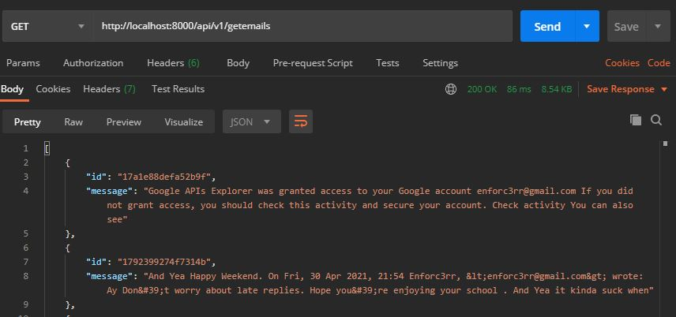

# Gmail-API 
This API makes use of GMAIL's official API to retrieve emails .   
It's A take home project made for iNext.

#### Packages Used 
- dotenv 
- express
- googleapis

#### End Point = GET /api/v1/getemails 

#### To Work with this API ->
1) Create config.env file under Configurations folder.
2)  Add These fields to config.env 
    - ID
    - SECRET
    - URI=https://developers.google.com/oauthplayground
    - TOKEN
    
3) Change Directory to the place where you have cloned this repo , type ```npm install``` to install the node_modules
4) Start The server by typing ```npm run start```

##### Proof



NOTE : Due to security reason GMAIL doesn't allow us to view the sender.
